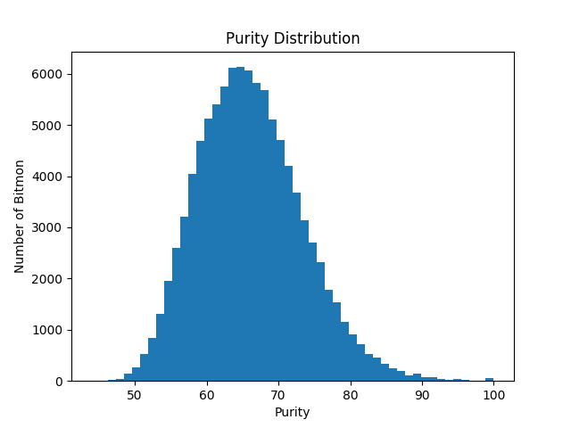
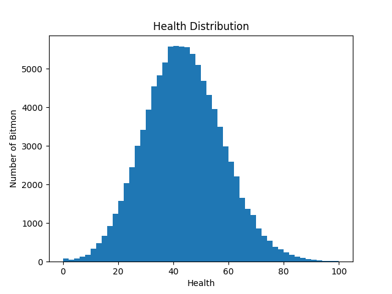

# Bitmon Breeding Algorithm

Assume `random()` returns a number between 0 and 1. `random(a, b)` returns a random number between a and b inclusive.

- `bitmonID = sha256(father + mother)[:8]` - Random deterministic number from father and mother combined
  - also add child number for both mother and father
- `fatherID = father.bitmonID`
- `motherID = mother.bitmonID`
- `gender = random() > 0.5`
- `purity`
  - `p = (father.purity + mother.purity) / 2`
  - Math.random() > 0.5
    - `purity = max(p - p/10 - 1, 0)`
  - else
    - `purity = p`
- `nature = max(min(50% * father.nature + 50% * mother.nature + random(-purity/10, +purity/10), 30), 0)`
- `variant`
  - special chance = 1% + 5% if father is special + 5% if mother is special
  - if father or mother is ugly: 5% chance of ugly
  - otherwise normal
- `h = 50% * father.h + 50% * mother.h + random(-purity/4, purity/4)`
- `a = 50% * father.a + 50% * mother.a + random(-purity/4, purity/4)`
- `sa = 50% * father.sa + 50% * mother.sa + random(-purity/4, purity/4)`
- `d = 50% * father.d + 50% * mother.d + random(-purity/4, purity/4)`
- `sd = 50% * father.sd + 50% * mother.sd + random(-purity/4, purity/4)`

## Purity Distribution

## Health/any other stat Distribution

## Features

- If you have 2 specials, the chance of a special is 10%.
- Uglies can either be rare or common

